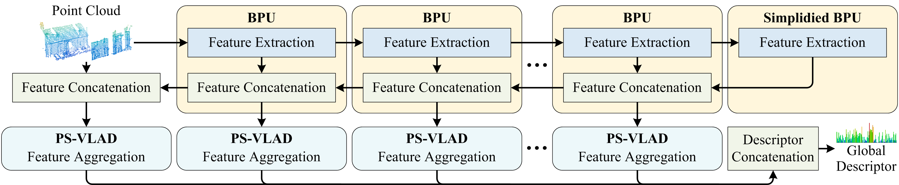

# [ICRA 2024] LPS-Net: Lightweight Parameter-shared Network for Point Cloud-based Place Recognition

Chengxin Liu, Guiyou Chen, Ran Song

Shandong University

## Introduction

We propose a lightweight parameter-shared network (LPS-Net), which includes multiple bidirectional perception units (BPUs) to extract multi-scale long-range contextual information and parameter-shared NetVLADs  (PS-VLADs) to aggregate descriptors. In the BPU, we design a parameter-shared convolution module (SharedConv) that can not only significantly compress the model but also enhance its ability to capture informative features. In the PS-VLAD, we replace half of the parameters used in the original NetVLAD with a trainable scalar and theoretically prove their equivalence. We designed variants of LPS-Net for three application scenarios. For limited computational resources, LPS-Net-S only includes one BPU. To balance between model performance and size, LPS-Net-M includes two BPUs. For scenarios requiring exceptional performance, LPS-Net-L includes three BPUs for higher accuracy. The experimental results demonstrate that our LPS-Net achieves the state-of-the-art on the point cloud based place recognition task while maintaining a highly lightweight model size.



## Pre-requisites

- Python 3.8
- CUDA 11.1
- Pytorch 1.8.0
- Numpy 1.19.5
- Pandas 1.2.2
- Scikit-learn 1.2.1
- PyYAML 6.0
- Thop 0.1.1.post2209072238

## Benchmark Datasets

* Download the zip file of the benchmark datasets found [here](https://drive.google.com/open?id=1H9Ep76l8KkUpwILY-13owsEMbVCYTmyx) and extract the folder to LPS_Net/benchmark_datasets.

* Generate pickle files. Note that the files only need to be generated once.

    ```
      cd dataldad/
    
      # For network training
      python generate_training_tuples_baseline.py
    
      # For network evaluation
      python generate_test_sets.py
    ```

## Training and Evaluation

- Build the ops

    ```
    cd libs/pointops && python setup.py install && cd ../../
    ```

- Train the network

    ```
    # To train the LPS-Net-S
    python train.py --config configs/LPS_Net_S.yaml
    
    # To train the LPS-Net-M
    python train.py --config configs/LPS_Net_M.yaml
    
    # To train the LPS-Net-L
    python train.py --config configs/LPS_Net_L.yaml
    ```

- Evaluate the pre-trained network

    ```
    # To evaluate the LPS-Net-S
    python eval.py --config configs/LPS_Net_S.yaml
    
    # To evaluate the LPS-Net-M
    python eval.py --config configs/LPS_Net_M.yaml
    
    # To evaluate the LPS-Net-L
    python eval.py --config configs/LPS_Net_L.yaml
    ```

- Calculate the size of the model

    ```
    # To calculate the size of the LPS-Net-S
    python calculate_model.py --config configs/LPS_Net_S.yaml
    
    # To calculate the size of the LPS-Net-M
    python calculate_model.py --config configs/LPS_Net_M.yaml
    
    # To calculate the size of the LPS-Net-L
    python calculate_model.py --config configs/LPS_Net_L.yaml
    ```

## Results

average recall@1%

| Method           | Oxford   | U.S.     | R.A.     | B.D      |
| ---------------- | -------- | -------- | -------- | -------- |
| PointNetVLAD     | 80.9     | 72.7     | 60.8     | 65.3     |
| LPD-Net          | 94.9     | 96.0     | 90.4     | 89.1     |
| PCAN             | 83.9     | 79.1     | 71.2     | 66.8     |
| PPT-Net          | 98.1     | 97.5     | 93.3     | 90.0     |
| MinkLoc3D        | 97.9     | 95.0     | 91.2     | 88.5     |
| SVT-Net          | 97.8     | 96.5     | 92.7     | 90.7     |
| EPC-Net          | 94.7     | 96.5     | 88.6     | 84.9     |
| EPC-Net-L-D      | 92.2     | 87.2     | 80.0     | 75.5     |
| LPS-Net-S (Ours) | 96.4     | 97.0     | 92.3     | 89.1     |
| LPS-Net-M (Ours) | 97.3     | 98.6     | 94.4     | **92.4** |
| LPS-Net-L (Ours) | **97.6** | **99.1** | **95.5** | 92.3     |

## Acknowledgement

Our code refers to PointNetVLAD and PPT-Net.

